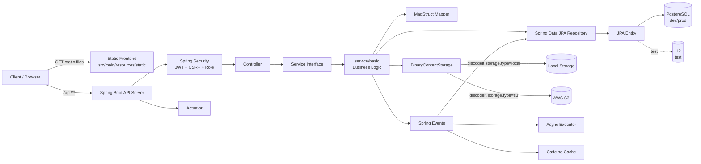

[](https://codecov.io/gh/codeit-bootcamp-spring/0-sprint-mission)
# Discodeit

Discodeit은 Spring Boot 기반의 채팅 서비스 백엔드 API 서버입니다. REST API를 제공하고, `src/main/resources/static`에 포함된 정적 프론트엔드 파일도 함께 서빙합니다.

## 기술 스택

- Java 17
- Spring Boot 3.4.0
- Gradle
- Spring Data JPA
- Spring Security
- JWT
- PostgreSQL
- H2 Test Database
- MapStruct
- AWS S3 SDK
- Caffeine Cache
- Spring Actuator
- Docker / Docker Compose
- GitHub Actions

## 주요 기능

- 사용자 회원가입, 조회, 수정, 삭제
- 로그인, 로그아웃, JWT 발급 및 갱신
- 역할 기반 권한 관리
- 공개 채널 / 비공개 채널 생성 및 관리
- 메시지 생성, 조회, 수정, 삭제
- 메시지 첨부 파일 업로드 및 다운로드
- 읽음 상태 관리
- 사용자별 알림 조회 및 삭제
- 파일 저장소 local / S3 전환
- Actuator 기반 상태 및 메트릭 조회

## 시스템 아키텍처



## 계층 구조

프로젝트는 다음 계층 규칙을 따릅니다.

```text
Controller -> Service -> Repository -> Entity
```

- `controller`: HTTP 요청과 응답 처리
- `controller/api`: Swagger/OpenAPI 인터페이스
- `service`: 서비스 인터페이스
- `service/basic`: 실제 비즈니스 로직 구현체
- `repository`: DB 접근
- `entity`: JPA 엔티티
- `dto/request`: 요청 DTO
- `dto/data`: 응답 데이터 DTO
- `dto/response`: 페이지 등 래퍼 응답 DTO
- `mapper`: MapStruct 기반 Entity / DTO 변환
- `storage`: 파일 저장소 추상화
- `event`: 비동기 이벤트 처리
- `security`: 인증, 인가, JWT 처리

## 데이터베이스 구조

주요 테이블은 다음과 같습니다.

- `users`
- `channels`
- `messages`
- `read_statuses`
- `binary_contents`
- `message_attachments`
- `notifications`

핵심 관계:

- User 1 - N Message
- Channel 1 - N Message
- User N - N Channel through ReadStatus
- Message N - N BinaryContent through MessageAttachment
- User 1 - N Notification
- User 1 - 0..1 BinaryContent as profile

`read_statuses`는 `(user_id, channel_id)` 조합에 대해 unique 제약을 가집니다. 중복 생성 요청은 Conflict 응답으로 처리되어야 합니다.

## API 목록

| Method | Path | 설명 |
| --- | --- | --- |
| GET | `/api/auth/csrf-token` | CSRF 토큰 발급 |
| POST | `/api/auth/login` | 로그인 |
| POST | `/api/auth/logout` | 로그아웃 |
| POST | `/api/auth/refresh` | JWT 갱신 |
| PUT | `/api/auth/role` | 사용자 역할 변경 |
| POST | `/api/users` | 사용자 생성 |
| GET | `/api/users` | 사용자 목록 조회 |
| PATCH | `/api/users/{userId}` | 사용자 수정 |
| DELETE | `/api/users/{userId}` | 사용자 삭제 |
| POST | `/api/channels/public` | 공개 채널 생성 |
| POST | `/api/channels/private` | 비공개 채널 생성 |
| GET | `/api/channels?userId={userId}` | 사용자가 참여한 채널 목록 조회 |
| PATCH | `/api/channels/{channelId}` | 공개 채널 수정 |
| DELETE | `/api/channels/{channelId}` | 채널 삭제 |
| POST | `/api/messages` | 메시지 생성 |
| GET | `/api/messages?channelId={channelId}` | 채널 메시지 페이지 조회 |
| PATCH | `/api/messages/{messageId}` | 메시지 수정 |
| DELETE | `/api/messages/{messageId}` | 메시지 삭제 |
| POST | `/api/readStatuses` | 읽음 상태 생성 |
| GET | `/api/readStatuses?userId={userId}` | 사용자 읽음 상태 목록 조회 |
| PATCH | `/api/readStatuses/{readStatusId}` | 읽음 상태 수정 |
| GET | `/api/binaryContents/{binaryContentId}` | 파일 메타데이터 조회 |
| GET | `/api/binaryContents?binaryContentIds={id}` | 파일 메타데이터 목록 조회 |
| GET | `/api/binaryContents/{binaryContentId}/download` | 파일 다운로드 |
| GET | `/api/notifications` | 내 알림 목록 조회 |
| DELETE | `/api/notifications/{notificationId}` | 내 알림 삭제 |

Swagger UI:

```text
http://localhost:8080/swagger-ui/index.html
```

## 실행 환경 변수

프로젝트는 `.env` 파일을 선택적으로 읽습니다.

```properties
SPRING_DATASOURCE_USERNAME=discodeit_user
SPRING_DATASOURCE_PASSWORD=discodeit1234
POSTGRES_USER=discodeit_user
POSTGRES_PASSWORD=discodeit1234

STORAGE_TYPE=local
STORAGE_LOCAL_ROOT_PATH=.discodeit/storage

AWS_S3_ACCESS_KEY=your-access-key
AWS_S3_SECRET_KEY=your-secret-key
AWS_S3_REGION=ap-northeast-2
AWS_S3_BUCKET=your-bucket
AWS_S3_PRESIGNED_URL_EXPIRATION=600

DISCODEIT_ADMIN_USERNAME=admin
DISCODEIT_ADMIN_EMAIL=admin@example.com
DISCODEIT_ADMIN_PASSWORD=admin-password

JWT_ACCESS_SECRET=your-access-token-secret
JWT_REFRESH_SECRET=your-refresh-token-secret
JWT_ACCESS_EXPIRATION_MS=1800000
JWT_REFRESH_EXPIRATION_MS=604800000
```

주의:

- 실제 AWS Key, JWT Secret, DB 비밀번호는 Git에 커밋하지 않습니다.
- `STORAGE_TYPE=local`이면 로컬 파일 시스템을 사용합니다.
- `STORAGE_TYPE=s3`이면 AWS S3를 사용합니다.

## 로컬 실행

PostgreSQL이 로컬에서 실행 중이어야 합니다.

기본 dev 설정:

```yaml
spring.datasource.url: jdbc:postgresql://localhost:5432/discodeit
spring.datasource.username: discodeit_user
spring.datasource.password: discodeit1234
server.port: 8080
```

실행:

```bash
./gradlew bootRun
```

Windows PowerShell:

```powershell
.\gradlew.bat bootRun
```

접속:

```text
http://localhost:8080
```

## Docker 실행

```bash
docker compose up --build
```

Docker Compose 실행 시 애플리케이션은 다음 포트로 노출됩니다.

```text
http://localhost:8081
```

Docker Compose 구성:

- `app`: Discodeit Spring Boot 애플리케이션
- `db`: PostgreSQL 16 Alpine
- `postgres-data`: PostgreSQL 데이터 볼륨
- `binary-content-storage`: local storage용 볼륨

주의:

- `Dockerfile`의 `PROJECT_VERSION`과 `build.gradle`의 `version`은 반드시 같아야 합니다.
- 현재 빌드 산출물 이름과 Dockerfile의 JAR 이름이 다르면 Docker 이미지 빌드 또는 실행이 실패할 수 있습니다.

## 테스트

전체 테스트 실행:

```bash
./gradlew test
```

Windows PowerShell:

```powershell
.\gradlew.bat test
```

특정 테스트 실행:

```bash
./gradlew test --tests ReadStatusApiIntegrationTest
```

테스트 환경은 `src/test/resources/application-test.yaml`을 사용하며, DB는 H2를 PostgreSQL 호환 모드로 실행합니다.

## Actuator

활성화된 주요 엔드포인트:

```text
/actuator/health
/actuator/info
/actuator/metrics
/actuator/loggers
```

예시:

```text
http://localhost:8080/actuator/health
```

## 저장소 정책

파일 저장소는 `discodeit.storage.type` 설정으로 결정됩니다.

| 값 | 구현체 | 설명 |
| --- | --- | --- |
| `local` | `LocalBinaryContentStorage` | 로컬 디스크에 파일 저장 |
| `s3` | `S3BinaryContentStorage` | AWS S3에 파일 저장, 다운로드 시 Presigned URL 사용 |

서비스 계층은 구체 저장소 구현체가 아니라 `BinaryContentStorage` 추상화에 의존합니다.

## 개발 규칙

- Controller에는 HTTP 요청/응답 처리만 작성합니다.
- 비즈니스 로직은 `service/basic`에 작성합니다.
- Repository에는 DB 접근 로직만 작성합니다.
- API 응답으로 JPA Entity를 직접 반환하지 않습니다.
- Entity / DTO 변환은 MapStruct를 사용합니다.
- ReadStatus는 동일한 user / channel 조합으로 중복 생성하지 않습니다.
- pagination 쿼리에서 fetch join 사용 시 N+1과 페이징 동작을 함께 확인합니다.
- 테스트 실패를 assertion 변경이나 disable로 우회하지 않습니다.

## 프로젝트 구조

```text
src/main/java/com/sprint/mission/discodeit
├── config
├── controller
│   └── api
├── dto
│   ├── data
│   ├── request
│   └── response
├── entity
├── event
├── exception
├── mapper
├── repository
├── security
├── service
│   └── basic
└── storage
    ├── local
    └── s3
```
